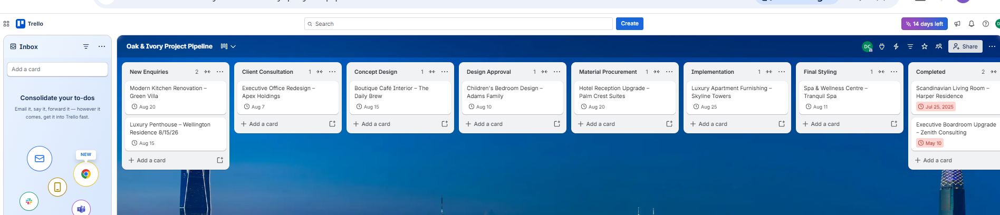
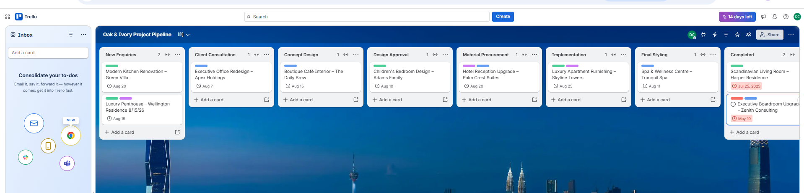
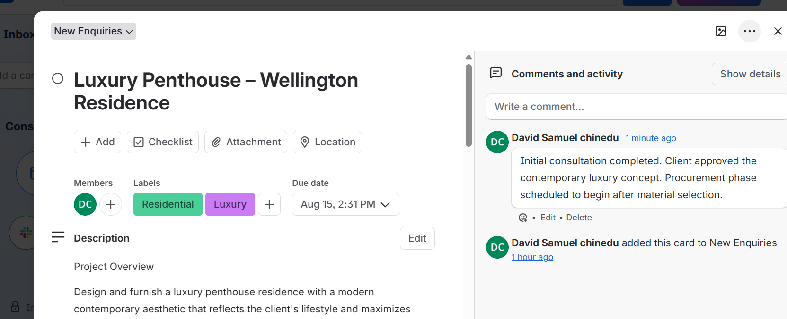
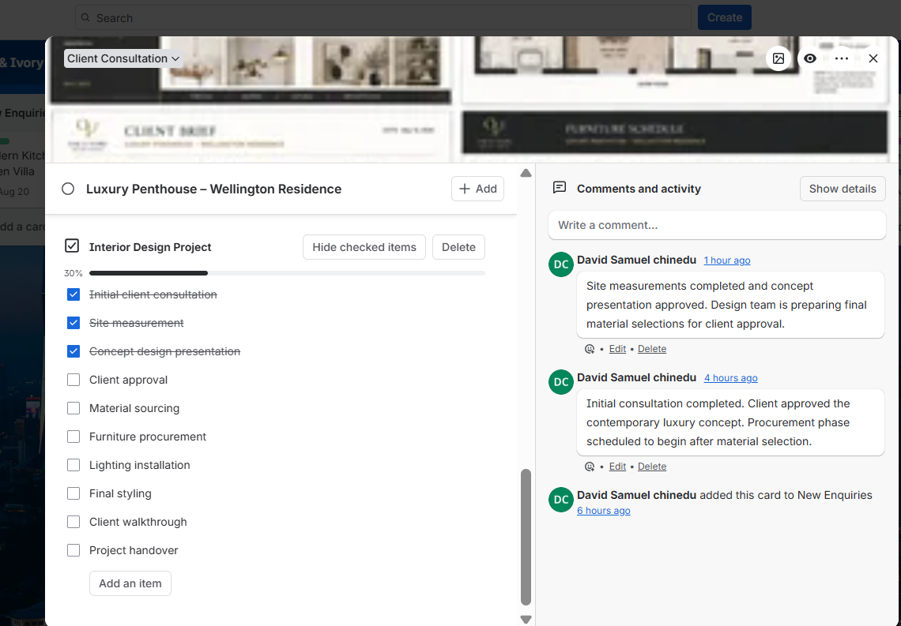
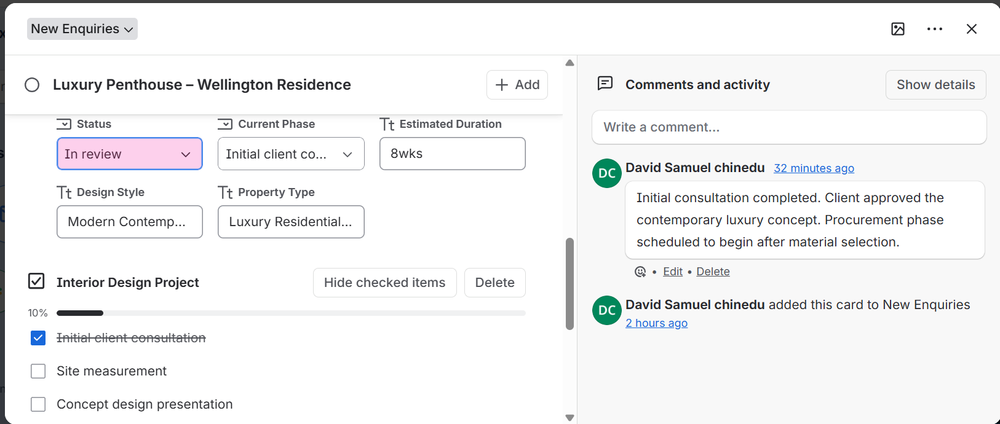
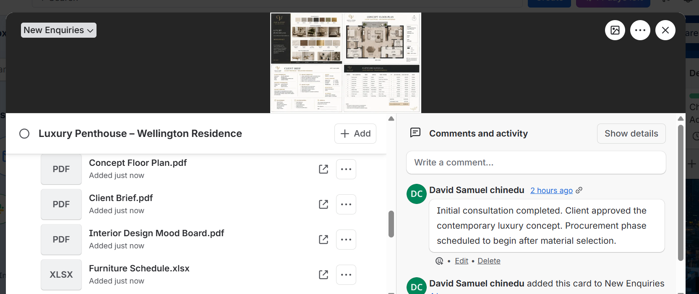
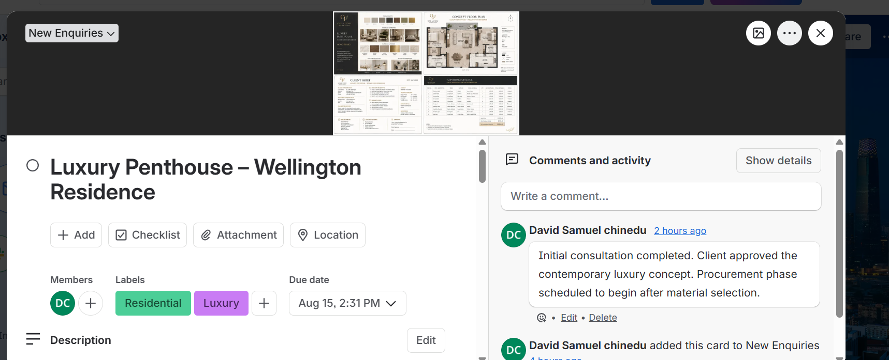
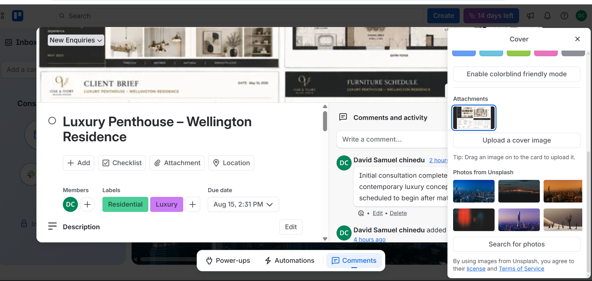
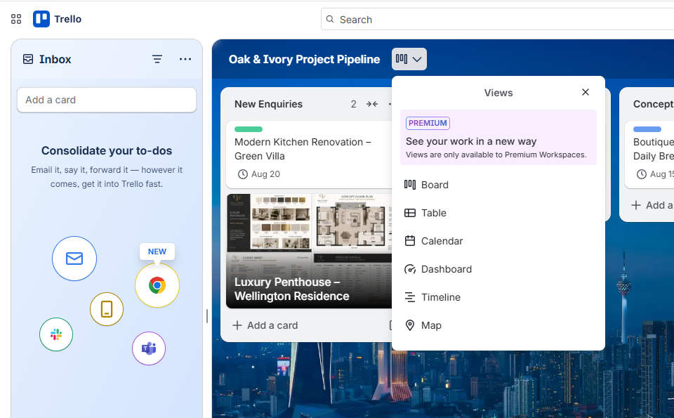
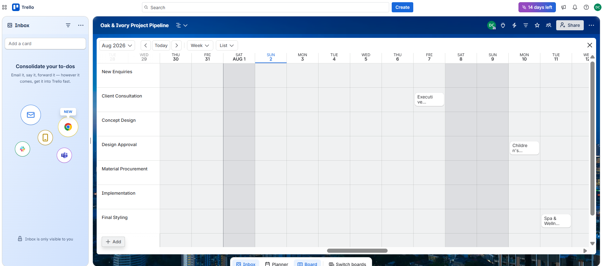

# Trello Interior Design Project Management

A complete Trello implementation for **Oak & Ivory Design Studio**, designed to manage luxury interior design projects from initial client enquiry through project completion.

---

## Project Overview

Oak & Ivory Design Studio required a centralized project management system to organize interior design projects, improve collaboration, monitor project progress, and keep all project resources in one place.

This implementation demonstrates how Trello can be configured as a lightweight project management solution using custom workflows, labels, checklists, attachments, automation, and multiple project views.

---

## Business Requirements

The solution was designed to enable the business to:

- Track projects from enquiry to completion
- Standardize project workflows
- Categorize projects by design type
- Monitor project progress visually
- Store project documents within each card
- Automate repetitive project management tasks
- Improve collaboration between design teams
- View projects using multiple planning layouts

---

# Solution Design

The Trello board was configured using the following workflow:

```
New Enquiries
      ↓
Client Consultation
      ↓
Concept Design
      ↓
Design Approval
      ↓
Material Procurement
      ↓
Implementation
      ↓
Final Styling
      ↓
Completed
```

---

## Features Implemented

- Custom project workflow
- Interior design project cards
- Colour-coded project labels
- Detailed project descriptions
- Progress tracking checklists
- Custom Fields
- File attachments
- Card cover images
- Butler Automation Rules
- Calendar View
- Timeline / Weekly View
- Multiple Board Views
- Workspace organization

---

# Technologies Used

- Trello
- Butler Automation
- Calendar View
- Card Covers
- Custom Fields
- Checklists
- Labels
- Attachments

---

# Documentation

| Document | Description |
|----------|-------------|
| [01-project-overview.md](documentation/01-project-overview.md) | Business objectives and project scope |
| [02-board-setup.md](documentation/02-board-setup.md) | Trello board configuration |
| [03-workflow-lists.md](documentation/03-workflow-lists.md) | Workflow design |
| [04-project-cards.md](documentation/04-project-cards.md) | Project card configuration |
| [05-card-description.md](documentation/05-card-description.md) | Card descriptions |
| [06-labels.md](documentation/06-labels.md) | Project labels |
| [07-checklists.md](documentation/07-checklists.md) | Progress tracking checklists |
| [08-custom-fields.md](documentation/08-custom-fields.md) | Custom project fields |
| [09-butler-automation.md](documentation/09-butler-automation.md) | Automation rules |
| [10-calendar-view.md](documentation/10-calendar-view.md) | Calendar planning |
| [11-card-cover.md](documentation/11-card-cover.md) | Card cover implementation |
| [12-board-views.md](documentation/12-board-views.md) | Multiple Trello views |
| [13-workspace.md](documentation/13-workspace.md) | Workspace organization |
| [14-project-progress.md](documentation/14-project-progress.md) | Project tracking |
| [15-final-results.md](documentation/15-final-results.md) | Final implementation summary |

---

# Screenshots

## 1. Project Workflow


---

## 2. Project Cards



---

## 3. Labels



---

## 4. Card Details



---

## 5. Project Checklist



---

## 5a. Checklist with Custom Fields



---

## 6. File Attachments



---

## 7. Card Cover



---

## 8. Cover Settings



---

## 9. Butler Automation


---

## 10. Calendar View


---

## 11. Available Views



---

## 12. Weekly Timeline



---

## 13. Workspace


---

## 14. Project Progress


---

## 15. Final Board Overview


---

# Repository Structure

```
trello-interior-design-project-management
│
├── documentation
│   ├── 01-project-overview.md
│   ├── 02-board-setup.md
│   ├── 03-workflow-lists.md
│   ├── 04-project-cards.md
│   ├── 05-card-description.md
│   ├── 06-labels.md
│   ├── 07-checklists.md
│   ├── 08-custom-fields.md
│   ├── 09-butler-automation.md
│   ├── 10-calendar-view.md
│   ├── 11-card-cover.md
│   ├── 12-board-views.md
│   ├── 13-workspace.md
│   ├── 14-project-progress.md
│   └── 15-final-results.md
│
├── screenshots
│
├── project-files
│
└── README.md
```

---

# Skills Demonstrated

- Project Management
- Workflow Design
- Process Mapping
- Task Management
- Business Process Improvement
- Agile Project Coordination
- Team Collaboration
- Documentation
- Workflow Automation
- Visual Project Planning
- File Management
- Calendar Scheduling

---

# Project Outcome

The completed Trello implementation provides a structured and scalable project management solution that enables Oak & Ivory Design Studio to manage interior design projects from enquiry through delivery.

The board centralizes project information, automates repetitive actions, improves visibility into project progress, and provides multiple planning views to support day-to-day operations.

---

## Repository


GitHub:

cbmaduka/trello-interior-design-project-management

# Author

## Chika Blessing

**Executive Business Partner | Success Partner | Healthcare Operations Specialist | CRM & Workflow Automation | Project Manager | Executive Virtual Assistant | Customer Success**

---

*"Same warmth, wherever you find me."*
