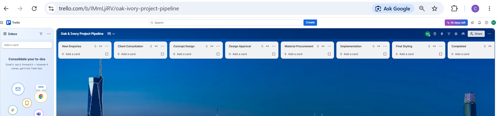
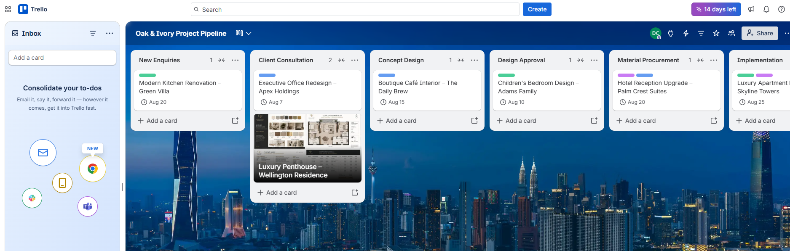

# Workflow Design

## Overview

A structured workflow was designed to reflect the complete lifecycle of an interior design project, ensuring that every project follows a consistent and standardized delivery process.

Instead of managing projects with unstructured task lists, each project progresses through clearly defined workflow stages from initial enquiry to final completion.

---

## Workflow Stages

The project workflow consists of the following lists:

1. New Enquiries
2. Client Consultation
3. Concept Design
4. Design Approval
5. Material Procurement
6. Implementation
7. Final Styling
8. Completed

---

## Workflow Explanation

### New Enquiries

Captures newly received client enquiries before project discussions begin.

### Client Consultation

Project requirements are gathered, client expectations are discussed, and site visits are scheduled where necessary.

### Concept Design

Initial concepts, layouts, and design ideas are prepared for client review.

### Design Approval

Design proposals are reviewed by the client before procurement activities begin.

### Material Procurement

Furniture, finishes, lighting, and other project materials are sourced and ordered.

### Implementation

Design plans are executed through installation and on-site project coordination.

### Final Styling

Decorative finishes, accessories, and final quality checks are completed before project handover.

### Completed

Projects are archived after successful completion and client handover.

---

## Business Value

The standardized workflow provides:

- Consistent project delivery.
- Improved project visibility.
- Better collaboration across teams.
- Easier progress tracking.
- Reduced risk of missed project stages.
- Improved accountability throughout the project lifecycle.

---

## Implementation Evidence

