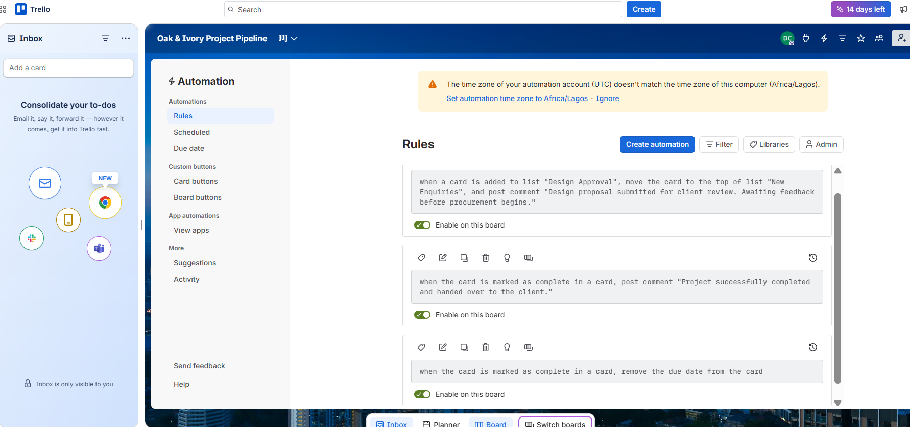

# Automation Rules

## Overview

Automation rules were configured using Trello's built-in automation features to reduce repetitive manual tasks and maintain consistency throughout the project lifecycle.

These automations help ensure project updates are recorded automatically and that workflow actions occur consistently as projects progress.

---

## Automation Configuration

The following automation rules were implemented:

- Post project update comments when cards reach key workflow stages.
- Record project completion activities automatically.
- Remove due dates after project completion to keep the board organized.

These rules improve consistency while reducing manual administrative work.

---

## Business Value

Automation provides several operational benefits:

- Reduces repetitive manual updates.
- Improves workflow consistency.
- Keeps project activity automatically documented.
- Supports better team communication.
- Saves administrative time.

---

## Implementation Evidence

