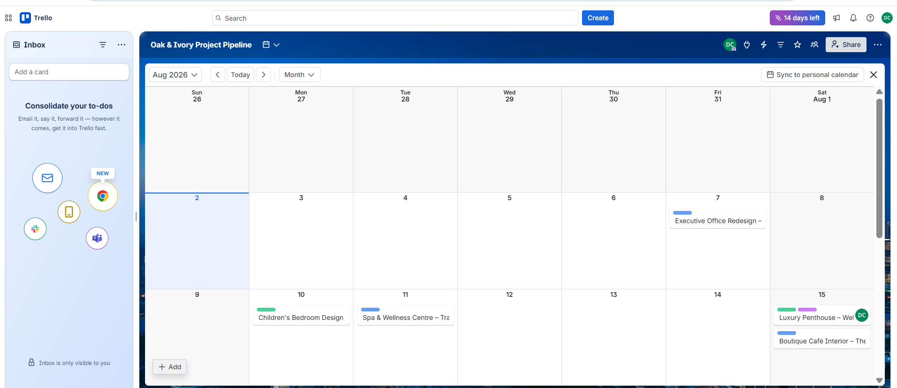

# Calendar View

## Overview

The Calendar View provides a schedule-based visualization of project activities using card due dates. It allows project managers to monitor deadlines, plan upcoming work, and ensure projects remain on track throughout the interior design lifecycle.

---

## Calendar Configuration

Project cards were assigned due dates that automatically appeared within Trello's Calendar View.

This enabled the team to:

- View project deadlines by date.
- Monitor upcoming deliverables.
- Identify scheduling conflicts.
- Improve planning across multiple projects.
- Track milestone completion.

---

## Benefits

Using the Calendar View provides several operational advantages:

- Improves deadline visibility.
- Supports project planning.
- Reduces the risk of missed deliverables.
- Provides a centralized schedule for all active projects.
- Helps balance workloads across multiple projects.

---

## Business Value

The Calendar View gives project managers a clear timeline of project commitments, making it easier to prioritize work, coordinate resources, and communicate delivery schedules with stakeholders.

---

## Implementation Evidence

