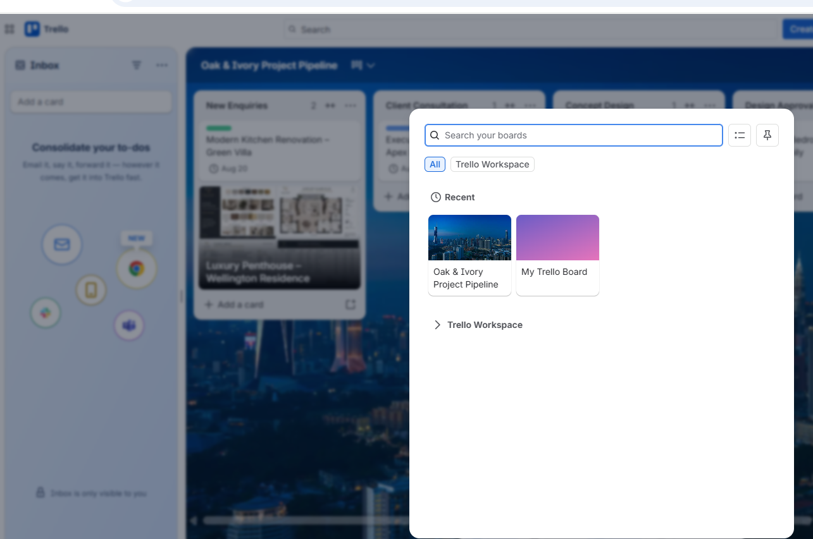

# Workspace Management

## Overview

A dedicated Trello Workspace was used to organize and manage project boards for Oak & Ivory Design Studio. The workspace provides a centralized environment where related boards can be grouped, accessed, and managed from a single location.

This approach supports scalability as additional projects and teams are added over time.

---

## Workspace Configuration

The Trello Workspace was configured to:

- Store project management boards.
- Organize related projects within a single workspace.
- Enable quick access to active boards.
- Support collaboration across multiple projects.
- Maintain a structured project management environment.

The implementation included the primary project board alongside the default Trello board, demonstrating how multiple boards can coexist within the same workspace.

---

## Benefits

Using a dedicated workspace provides several operational advantages:

- Centralized project organization.
- Easier navigation between boards.
- Improved collaboration.
- Better scalability as new projects are created.
- Consistent management of business operations.

---

## Business Value

Workspace management creates a structured environment for organizing multiple projects while maintaining consistency across teams. As the organization grows, additional boards can be added without affecting existing workflows, making the solution suitable for long-term project management.

---

## Implementation Evidence

