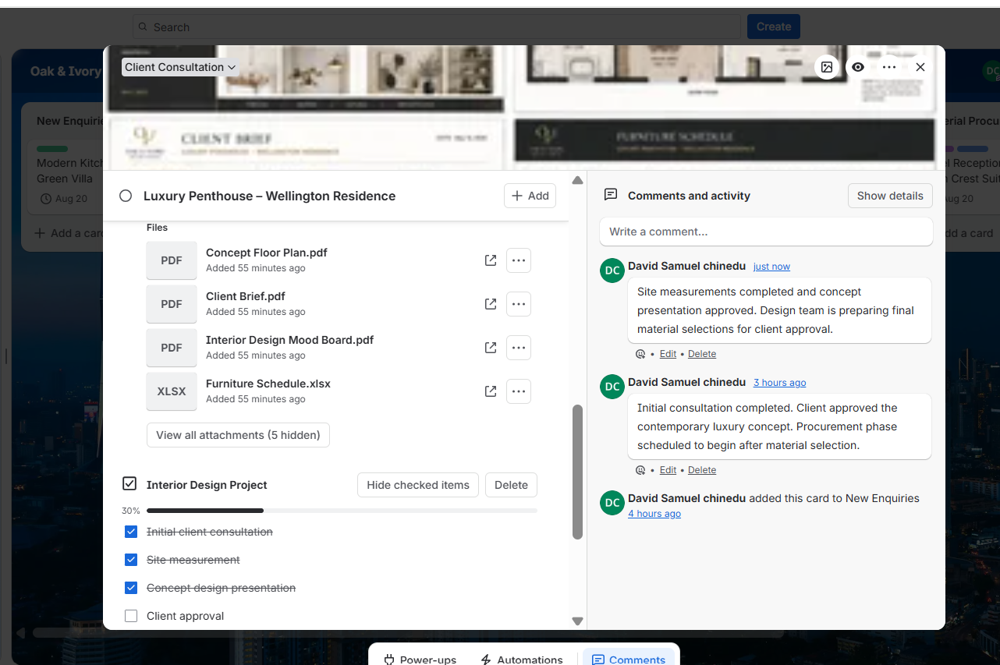

# Project Progress

## Overview

Project progress was tracked throughout the implementation using Trello's built-in workflow management features. By combining workflow stages, checklists, due dates, comments, and activity history, the board provides real-time visibility into the status of each interior design project.

---

## Progress Tracking

Each project card progresses through predefined workflow stages as work is completed.

Progress is monitored using:

- Workflow stage movement.
- Checklist completion.
- Due dates.
- Project comments.
- Activity history.
- Supporting project documentation.

This approach enables project managers to monitor implementation status and identify outstanding work without opening multiple systems.

---

## Progress Indicators

The implementation demonstrates project progress through:

- Completed checklist items.
- Updated project comments.
- Active workflow stage.
- Attached project documents.
- Project due date.
- Visual card cover.

These indicators provide an accurate representation of project status at any point during the implementation lifecycle.

---

## Business Value

Tracking project progress within Trello improves visibility, accountability, and communication across the project team. Team members can quickly understand the current status of a project, review completed work, and identify remaining activities before project completion.

---

## Implementation Evidence

